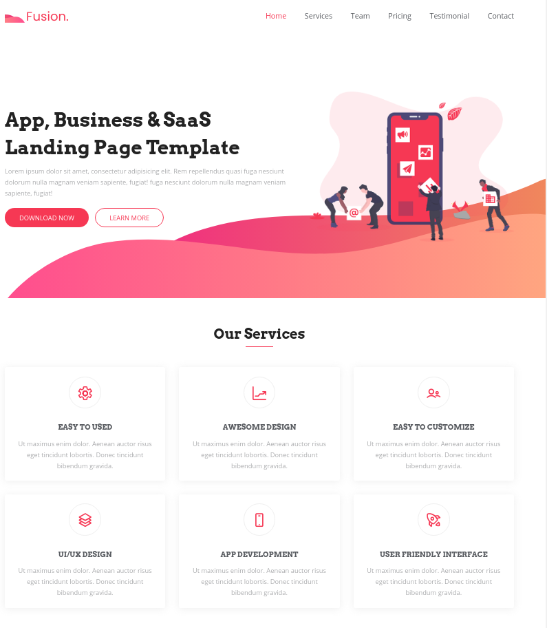
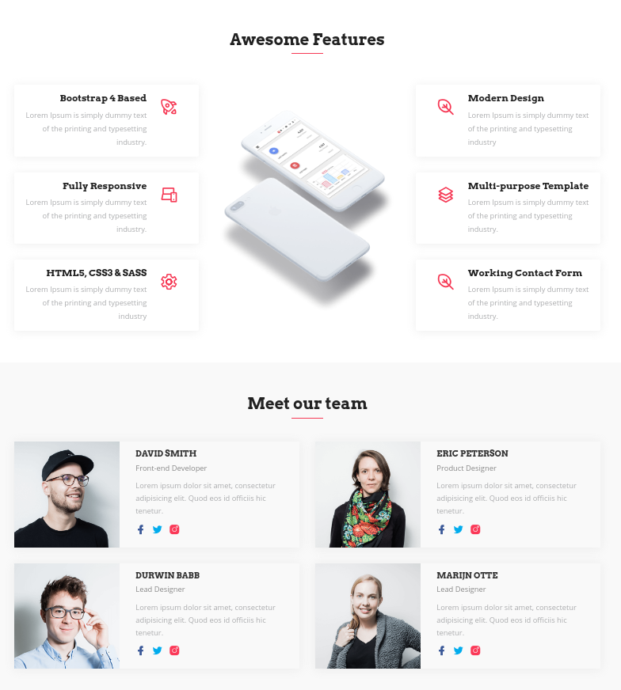

# Fusion - Corporate Website
> In this project, a free template version was used, built with Bootstrap 4, but all back-and Python language was developed, using Django Framework and PostgreSQL database.

Features include a fixed header navigation (that smooth scrolls to sections), services overview, product feature section, pricing tables, testimonial slider, team, Google Maps and a contact form.

## Meta

Jeverson Luis - jever.contato@gmail.com

[https://github.com/jeversonluis/django_fusion](https://github.com/jeversonluis/django_fusion)

